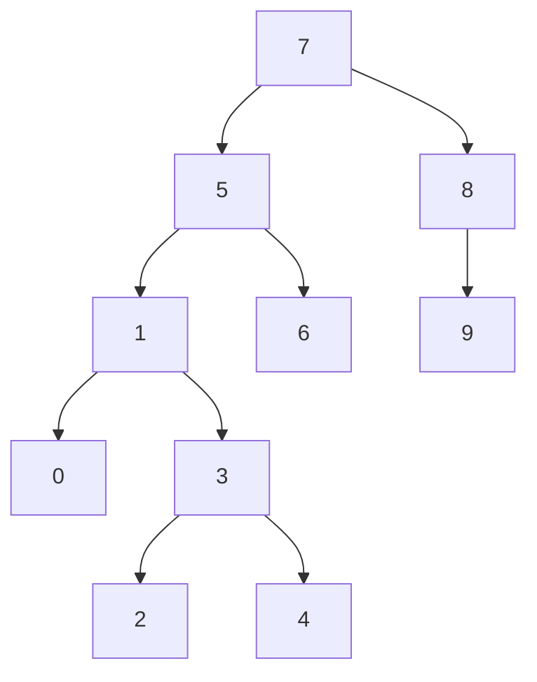

# Binary Search Tree Projesi
## Proje-3
[7, 5, 1, 8, 3, 6, 0, 9, 4, 2] dizisinin Binary-Search-Tree aşamalarını yazınız.

Örnek: root x'dir. root'un sağından y bulunur. Solunda z bulunur vb.

```sh
                          7
                         / \
                        5   8
                       / \   \
                      1   6   9
                     / \
                    0   3
                       / \
                      2   4
```

